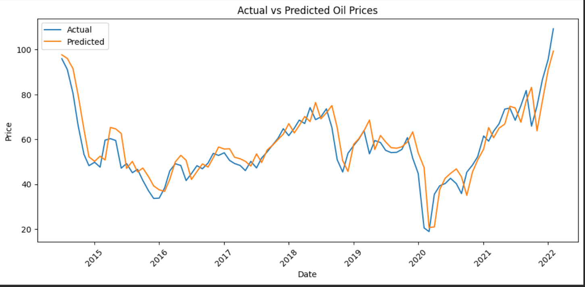

# 🚀 Crude Oil Price Prediction using Machine Learning

## 🎯 Problem Statement

Crude oil prices are highly volatile and influenced by multiple economic and geopolitical factors.
The objective of this project is to build a machine learning model that can **predict future crude oil prices** using historical data.

---

## 🌍 Why This Project Matters

Crude oil is one of the most important global commodities. Its price impacts:

* Energy markets
* Inflation and economy
* Investment decisions

Accurate prediction can help in better decision-making and analysis.

---

## 📊 Dataset

* Historical crude oil price dataset
* Time-series data (daily prices)

---

## 🔍 Exploratory Data Analysis (EDA)

Performed:

* Price trend analysis over time
* Weekly and monthly volatility (rolling standard deviation)
* Correlation analysis
* Seasonal patterns (month/year trends)

---

## ⚙️ Feature Engineering

To improve model performance, time-series features were created:

### 🔹 Lag Features

* `Lag_1` → Previous day price
* `Lag_7` → Price from previous week

### 🔹 Rolling Features

* `rolling_7` → 7-day moving average
* `rolling_std_7` → 7-day volatility

### 🔹 Target Variable

* `target` → Next day price (`shift(-1)`)

---

## 🤖 Models Used

* Linear Regression
* Random Forest Regressor

---

## 📈 Model Performance

| Model             | MAE  | MSE    | R² Score |
| ----------------- | ---- | ------ | -------- |
| Linear Regression | 5.17 | 47.64  | 0.79     |
| Random Forest     | 7.99 | 116.17 | 0.50     |

---

## 📊 Visual Results

### 📈 Actual vs Predicted Prices



### 📊 Feature Importance


### 📉 Residual Plot


---

## 🧠 Key Insights

* Crude oil prices show **strong dependency on past values**
* Lag features significantly improve prediction accuracy
* Linear Regression performed better than Random Forest due to dataset size and linear trends
* Feature engineering plays a crucial role in time-series prediction

---

## ⚠️ Challenges

* Limited dataset size (~400 usable rows after preprocessing)
* High correlation between features
* Avoiding data leakage during feature creation

---

## 🚀 Future Improvements

* Implement advanced models like XGBoost
* Perform multi-step forecasting (predict multiple future days)
* Include external features (economic indicators, global events)
* Build an interactive dashboard for predictions

---

## 🛠️ Tech Stack

* Python
* Pandas, NumPy
* Matplotlib, Seaborn, Plotly
* Scikit-learn

---

## 📂 Project Structure

```
crude-oil-price-prediction/
│── data/
│   └── crude-oil-price.csv
│
│── notebook/
│   └── oil_price_analysis.ipynb
│
│── images/
│   ├── actual_vs_predicted.png
│   ├── feature_importance.png
│   ├── residual_plot.png
│
│── README.md
│── requirements.txt
```

---

## ▶️ How to Run

```bash
# Clone repository
git clone https://github.com/ShahDhairya16/crude-oil-price-prediction

# Install dependencies
pip install -r requirements.txt

# Run notebook
```

---

## 📌 Conclusion

This project demonstrates how machine learning combined with time-series feature engineering can effectively model short-term crude oil price movements.
While the results are promising, further improvements can be achieved using advanced models and additional data sources.

---

## 👨‍💻 Author

Dhairya Shah

---

## ⭐ If you found this useful, consider giving this repository a star!
